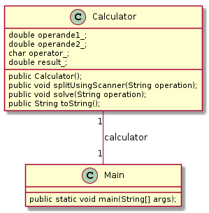

# TP Java n<sup>o</sup> 1

## Utiliser la classe String - une calculette syntaxique (1)

### Objectif
Apprendre à manipuler classes et objets en utilisant les classes `String` et `Scanner` du langage Java.

### Pré-requis
Cours - les classes et les objets

### Travail demandé

**La calculette syntaxique (1)**  

On se propose de réaliser une calculette syntaxique minimale chargée d'analyser une chaîne de caractères représentant un calcul à effectuer.
Les chaînes de caractères doivent respecter la forme suivante :

```opérande1 <opérateur> opérande2```

Voici quelques exemples de chaînes de caractères :

```
4 - 27
62.5 / 0
7 * 9
0.64128 * 3.14159
```

La chaîne de caractères "fin" permet de quitter l'application par un appel à la méthode `System.exit(0)`.

On réalisera une classe `Calculator` comme l'indique le diagramme de classes suivant :



### Conditions
*   JDK 1.8
*   Système d'exploitation Linux, Mac OS X ou Ms-Windows
*   La documentation des classes [String](https://docs.oracle.com/javase/1.5.0/docs/api/java/lang/String.html) et [Scanner](https://docs.oracle.com/javase/1.5.0/docs/api/java/util/Scanner.html)

### Critères d'évaluation
*   Qualité et organisation des documents rendus (codes sources, fichier LISEZMOI, etc.)
*   Autonomie
