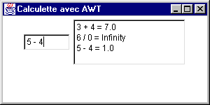
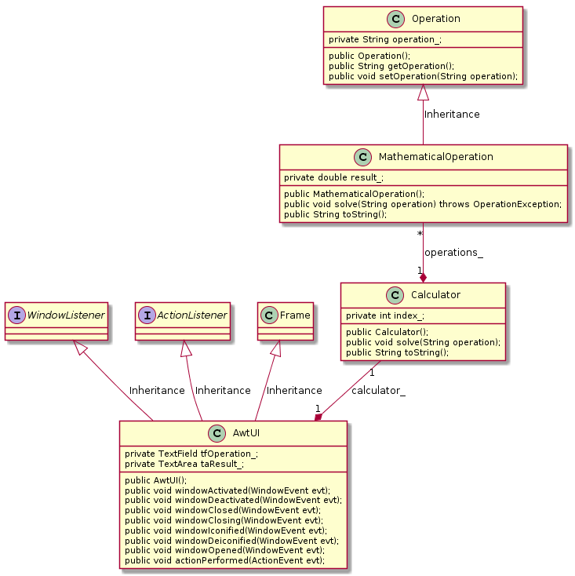

# TP Java no 4

## Interface graphique avec AWT - amélioration de la calculette (4)

### Objectif
Apprendre à réaliser des interfaces graphiques en Java (version AWT).

## Pré-requis
Cours - interface graphique avec AWT

### Travail demandé

**La calculette syntaxique (4)**  
On se propose de reprendre la calculette du TP précédent. On souhaite que cette dernière bénéficie à présent d'une interface homme-machine graphique 
du type minimal fourni ci-après.

Utiliser les classes `Calculator`, `Operation` et `MathematicalOperation` sans les modifier afin de profiter des avantages de la programmation objet, puis 
créer une nouvelle classe nommée `AwtUI` et utilisant la classe `Calculator`. 
Dans un premier temps on laissera de côté la réalisation d'une interface qui respecte des
patrons de conception tels que [MVC](https://en.wikipedia.org/wiki/Model–view_–controller) ou [MVP](https://en.wikipedia.org/wiki/Model–view_–presenter). 
Le diagramme de classes correspondant respectera la forme suivante :

Facultatif : améliorer l'ergonomie de l'interface graphique ainsi que sa structure, en déléguant par exemple la gestion des événements à une autre classe.

### Conditions
*   JDK 1.8
*   Système d'exploitation Linux, Mac OS X ou Ms-Windows
*   L'outil de modélisation/génération de code : [ArgoUML](http://argouml-fr.tigris.org/)

### Critères d'évaluation
*   Qualité et organisation des documents rendus (codes sources, fichier LISEZMOI, etc.)
*   Autonomie
